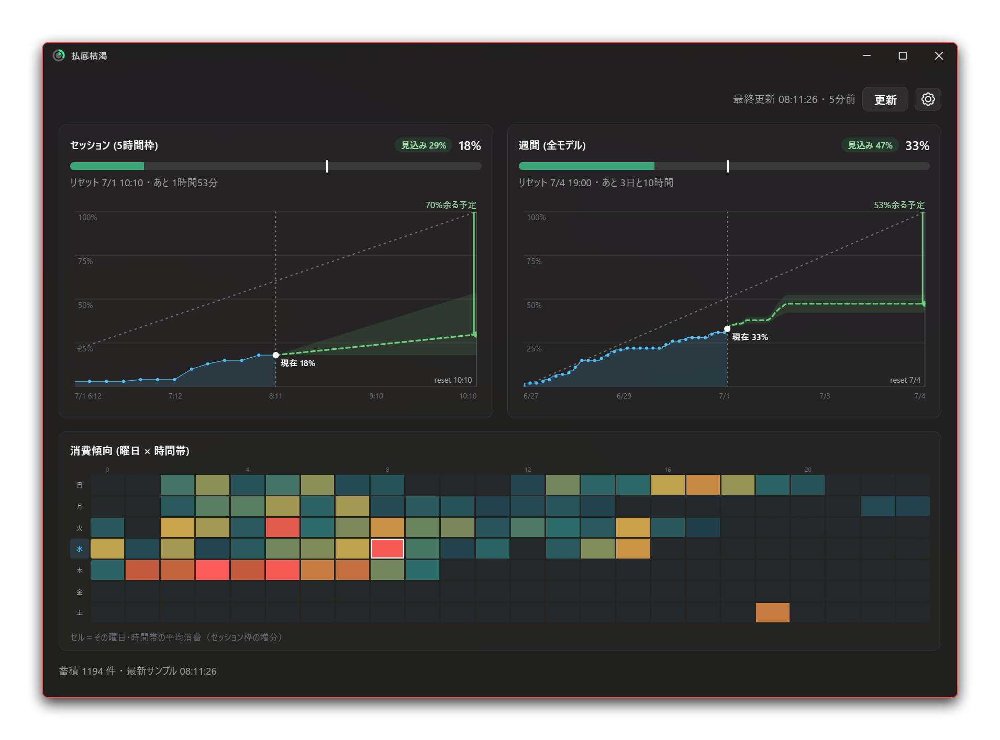

# Futtei-Kokatsu

> 🌐 **[日本語 README →](README.ja.md)**

A desktop-resident app that periodically fetches your Claude usage and displays it as bar charts, along with a line-based projection and consumption trends by day of week and hour. It visualizes — at a glance — whether you will run dry before the next reset, or still have room to push.

Under the hood, it calls `claude -p "/usage"` on a timer to read the remaining amount, accumulates the history, and draws a burndown chart overlaying an ideal-pace diagonal and a projection of where each quota lands at reset time. It also draws a circular gauge onto the tray icon, so you can read your current usage without even opening the window.

> **This is an early release.** Treat it as barely more than a spike for now.

## Download

Grab the installer from the [latest release](https://github.com/Romly-Romly/futtei-kokatsu/releases/latest).

### Windows

- **Installer** — `*-setup.exe`

The app is not code-signed, so Windows SmartScreen will warn you on first launch. Click "More info", then "Run anyway" to start it. Use at your own risk.

### macOS

Planned.

## Requirements

| OS | Version |
|---|---|
| Windows | 10 / 11 (64-bit) |

**Claude Code is required.** This app reads your usage by invoking the `claude` command-line tool, so you must have [Claude Code](https://www.claude.com/product/claude-code) installed and signed in to a Claude subscription.

## How to Use

Launch it and leave it in the tray. It fetches automatically every 10 minutes (and once right after launch), so the meters and charts fill in on their own. As long as `claude -p "/usage"` returns your usage, there is nothing to configure.

- Charts zoom horizontally with the wheel, vertically with Ctrl+wheel, and pan by dragging. Double-click to return to the full view.
- Closing the window does not quit the app; it hides to the tray. To quit completely, choose **Quit** from the tray icon.
- Settings (theme, display language, date format, trend visibility, launch at login) live inside the gear icon.

## Settings

### Where settings are stored

Settings and accumulated history are saved in the OS user-data directory.

| OS | Path |
|---|---|
| Windows | `%APPDATA%\com.romly.futteikokatsu\` |
| macOS | `~/Library/Application Support/com.romly.futteikokatsu/` |

`settings.json` holds your preferences and `history.jsonl` holds the recorded usage samples. Delete this folder yourself if you want them gone when you uninstall.

### Auto-launch

If you enabled launch-at-login, the app registers itself under `HKEY_CURRENT_USER\Software\Microsoft\Windows\CurrentVersion\Run`. This registration should be removed when you uninstall.

## Changelog

See the **[CHANGELOG](CHANGELOG.md)**.

## License

[GNU General Public License version 3](LICENSE) (GPL-3.0)

Copyright (C) 2026 Romly

This program is free software. Under the GPL-3 you may redistribute and modify it. If you distribute a modified version, you must release its source code under the same GPL-3.0.
